# SlimStorage

A self-hosted key/value store and event API. One PHP file to install, one dashboard to manage everything.

[](https://github.com/kibotu/SlimStorage/releases/latest)
[](https://github.com/kibotu/SlimStorage/actions/workflows/release.yml)
[](https://github.com/kibotu/SlimStorage/actions/workflows/preview.yml)
[](LICENSE)
[](https://php.net/)
[](https://www.mysql.com/)

## Why SlimStorage?

Sometimes you just need a simple API to store and retrieve data. No vendor lock-in, no monthly bills, no complicated setup. Just upload one file, follow the wizard, and you're done.

**Perfect for:**
- Mobile apps that need cloud sync
- IoT devices pushing sensor data
- Side projects that need a quick backend
- Teams who want full control over their data

## What's Inside

| Feature | What it does |
|---------|--------------|
| **Key/Value Store** | Store JSON, strings, whatever. Each API key gets its own isolated namespace. |
| **Event API** | Push time-series data with millisecond precision. Great for analytics, logs, sensor readings. |
| **Schema Optimization** | Define schemas for sub-millisecond queries on millions of events. |
| **Admin Dashboard** | Manage API keys, browse data, test endpoints, view logs. |
| **Superadmin Panel** | System-wide analytics, user management, session monitoring. |

## Quick Start

### 1. Download and run the installer

```bash
wget https://github.com/kibotu/SlimStorage/releases/latest/download/install.php
```

Upload it to your server and open `https://yourdomain.com/install.php` in your browser.

### 2. Follow the wizard

The installer handles everything:

- **Checks requirements** — PHP version, extensions, write permissions
- **Downloads the latest release** — Fetches from GitHub, extracts all files
- **Guides you through config** — Database credentials, Google OAuth setup
- **Tests your database** — Verifies connection before proceeding
- **Creates the schema** — Sets up all tables automatically
- **Generates `.secrets.yml`** — Stores your configuration securely

### 3. Delete the installer

For security, remove `install.php` after you're done.

That's it. 🎉

---

## The Dashboard

After logging in with Google OAuth, you land on the admin dashboard. Here's what you can do:

### Landing Page

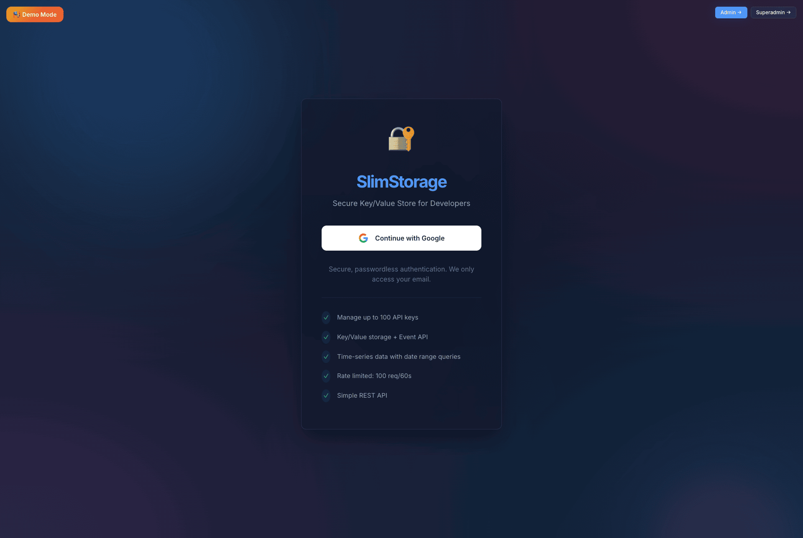

Simple, clean login. One button to authenticate with your Google account.

---

### API Keys

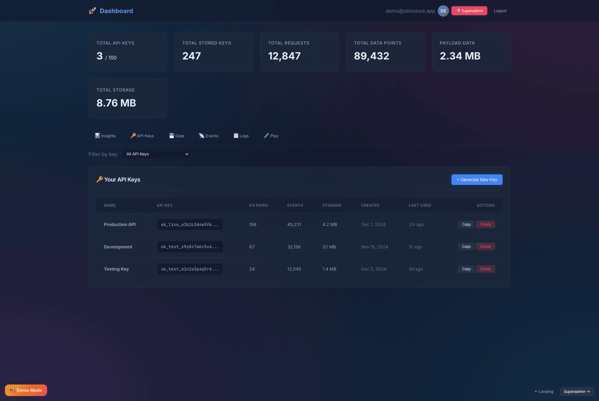

Your starting point. Create, rename, and delete API keys. Each key has:

- **64-character cryptographically secure token** — Copy it, use it in your apps
- **Usage stats** — Requests per day/week/month at a glance
- **Quick actions** — Rename, regenerate, or delete

---

### Data Explorer

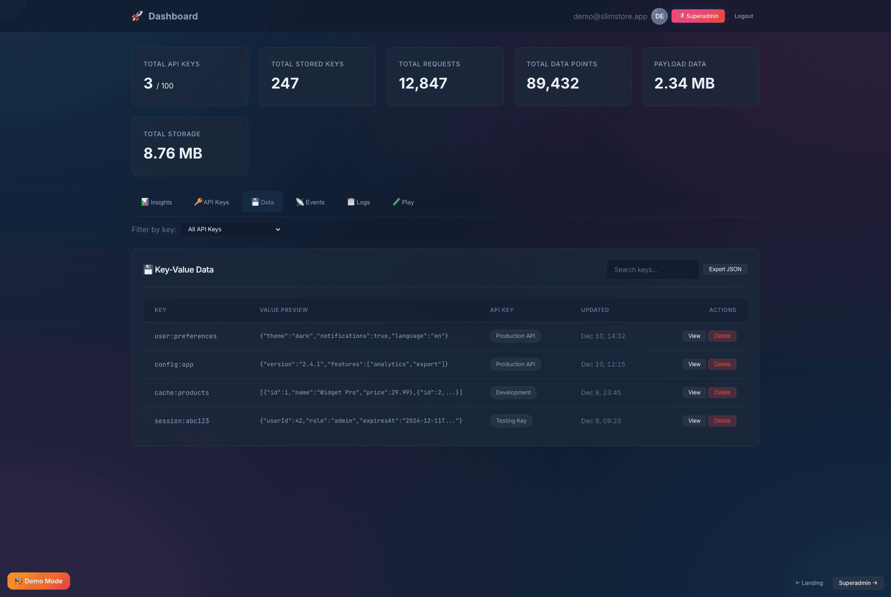

Browse all your stored key/value pairs. Search, filter, view JSON payloads. Useful for debugging or just seeing what's in there.

---

### Events

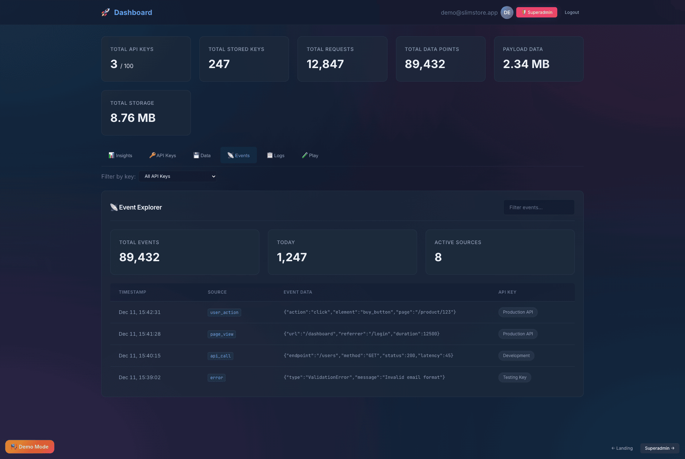

Your time-series data, visualized. Query by date range, see event distribution over time, drill into individual records.

---

### API Playground

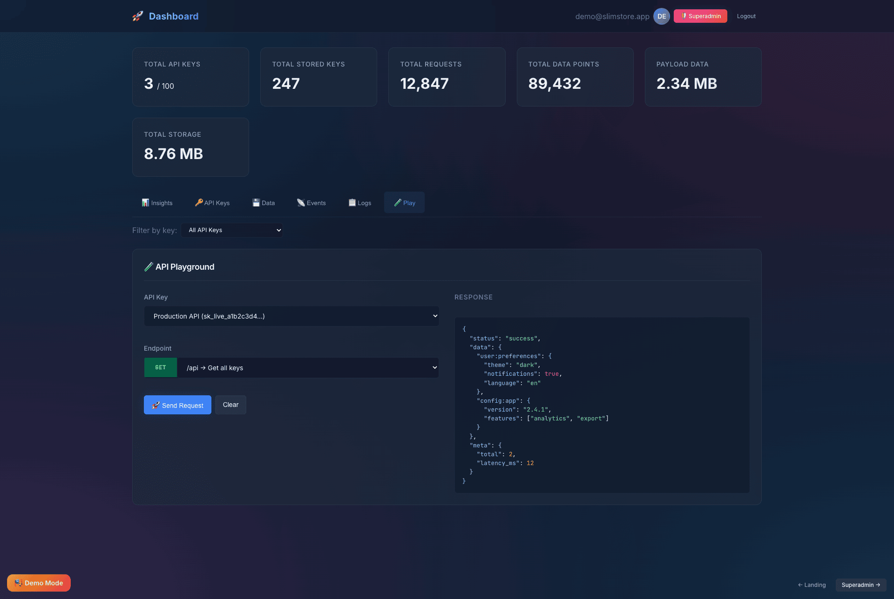

Test any endpoint right from the browser. Pick a method, choose an endpoint, send requests, see responses. No curl needed.

---

### Insights

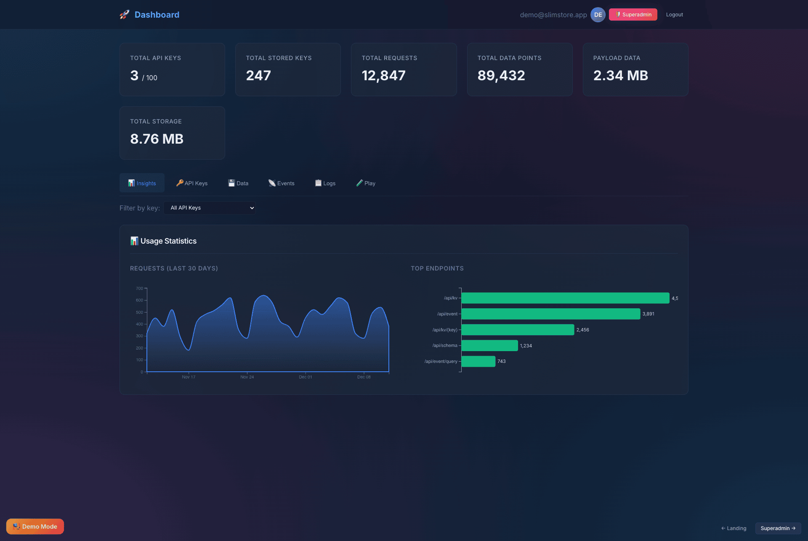

Usage analytics for your API keys. Request counts, success rates, top endpoints — everything you need to understand how your API is being used.

---

### Logs

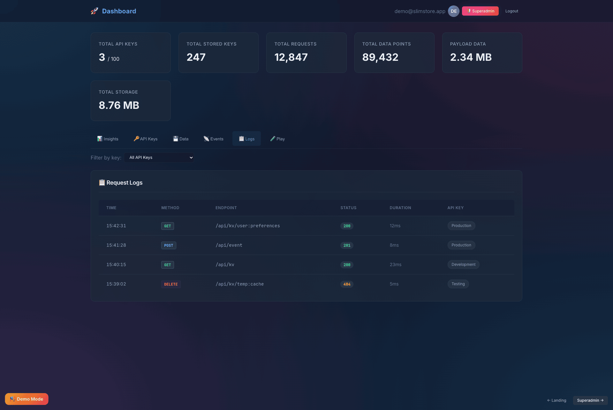

Every API request logged. Filter by status, method, endpoint. Great for debugging issues or tracking down that one weird request.

---

## Superadmin Panel

If you're the system admin (configured in `.secrets.yml`), you get access to the superadmin panel.

### System Insights

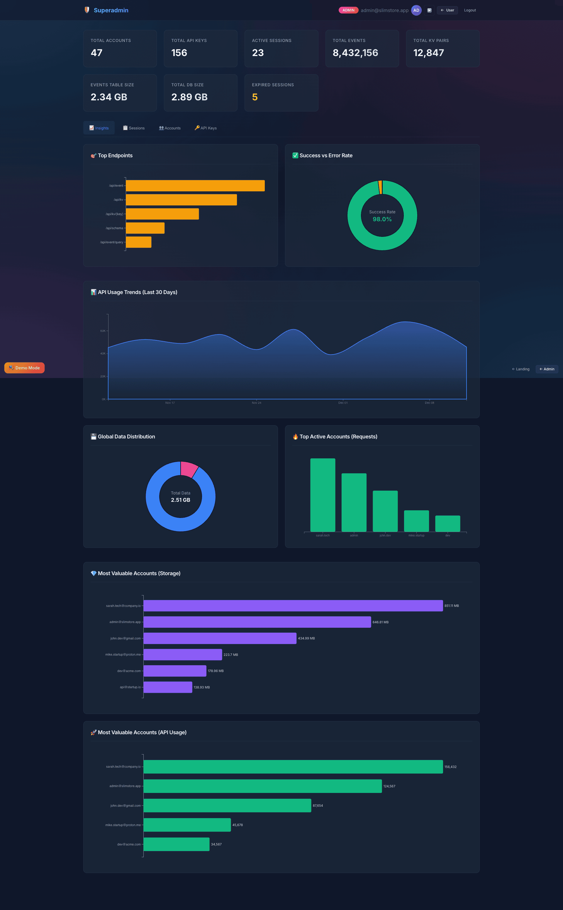

Bird's-eye view of everything. Total accounts, API keys, events, storage usage. The charts tell you if things are healthy.

---

### All Accounts

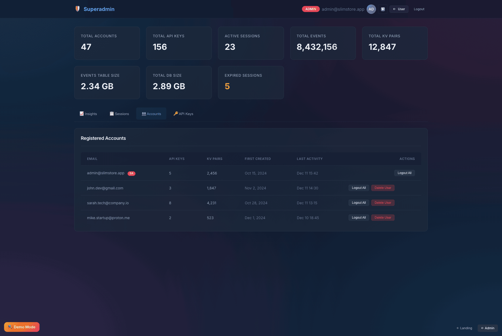

Every user in the system. See who signed up, when they last logged in, how many keys they have. Manage access if needed.

---

### All API Keys

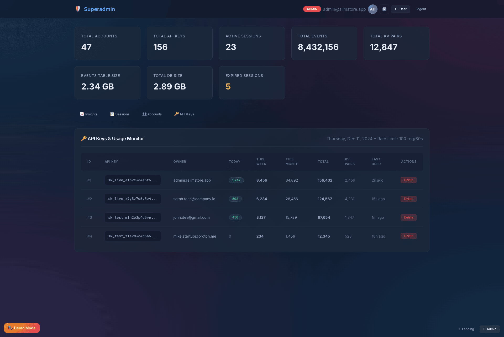

System-wide API key management. See every key across all accounts. Useful for audits or troubleshooting.

---

### Sessions

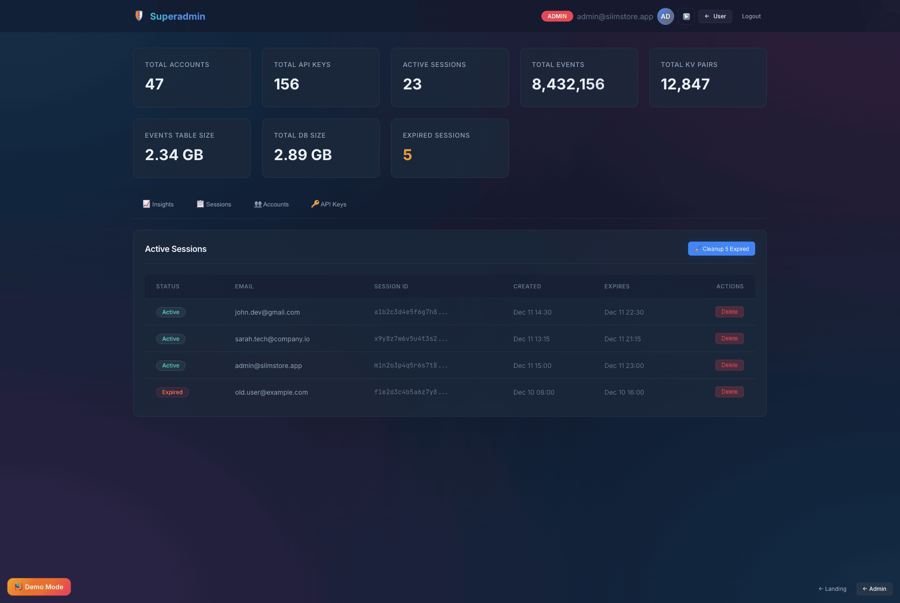

Active sessions across the system. See who's logged in, from where, and when their session expires. Revoke if needed.

---

## API Reference

### Authentication

Every request needs your API key in the header:

```bash
X-API-Key: your_64_character_api_key_here
Content-Type: application/json
```

### Key/Value Store

| Endpoint | Method | Body | Description |
|----------|--------|------|-------------|
| `/set` | POST | `{"value": "data"}` | Store a value, get back a UUID |
| `/set` | POST | `{"key": "uuid", "value": "data"}` | Update existing or upsert |
| `/get` | POST | `{"key": "uuid"}` | Retrieve a value |
| `/exists` | POST | `{"key": "uuid"}` | Check if key exists |
| `/delete` | POST | `{"key": "uuid"}` | Delete a key |
| `/list` | GET | - | List all keys |
| `/clear` | DELETE | - | Delete all keys |

**Example:**

```bash
# Store something
curl -X POST "https://yourdomain.com/api/set" \
  -H "X-API-Key: YOUR_KEY" \
  -H "Content-Type: application/json" \
  -d '{"value": {"user": "alice", "score": 42}}'

# Response: {"status": "success", "key": "a7469afb-8ad2-4a75-b565-1a931aa2ad0d"}
```

### Event API

Push time-series data. Perfect for IoT, analytics, monitoring.

| Endpoint | Method | Body | Description |
|----------|--------|------|-------------|
| `/event/push` | POST | `{"data": {...}}` | Store event (max 1000/request) |
| `/event/query` | POST | `{"start_date": "...", "end_date": "..."}` | Query by date range |
| `/event/aggregate` | POST | `{"granularity": "hourly"}` | Query pre-aggregated data |
| `/event/stats` | GET | - | Get statistics |
| `/event/clear` | DELETE | - | Delete all events |

**Example:**

```bash
# Push sensor reading
curl -X POST "https://yourdomain.com/api/event/push" \
  -H "X-API-Key: YOUR_KEY" \
  -H "Content-Type: application/json" \
  -d '{"data": {"temperature": 23.5, "humidity": 65}}'
```

### Schema API

Define schemas to enable sub-millisecond aggregation queries on millions of events.

```bash
# Define schema for sensor data
curl -X POST "https://yourdomain.com/api/schema" \
  -H "X-API-Key: YOUR_KEY" \
  -H "Content-Type: application/json" \
  -d '{
    "fields": [
      {"name": "temperature", "type": "float"},
      {"name": "humidity", "type": "integer"}
    ],
    "aggregations": ["hourly", "daily"]
  }'
```

**Performance with 11M events:**

| Query | Without Schema | With Schema |
|-------|----------------|-------------|
| Last 24h (hourly) | 3-5 seconds | <1ms |
| Last 30 days (daily) | 5-10 seconds | <1ms |

---

## Configuration

All settings live in `.secrets.yml`:

```yaml
database:
  host: localhost
  port: 3306
  name: your_database
  user: your_user
  password: your_password
  prefix: slimstore_

domain:
  name: yourdomain.com

google_oauth:
  client_id: YOUR_CLIENT_ID.apps.googleusercontent.com
  client_secret: YOUR_CLIENT_SECRET
  redirect_uri: https://yourdomain.com/admin/callback.php

superadmin:
  email: admin@example.com

api:
  rate_limit_requests: 10000
  rate_limit_window_seconds: 60
  max_keys_per_user: 100
  max_value_size_bytes: 262144
```

### Google OAuth Setup

1. Go to [Google Cloud Console](https://console.cloud.google.com/)
2. Create a project, enable Google+ API
3. Create OAuth 2.0 credentials
4. Set redirect URI to `https://yourdomain.com/admin/callback.php`
5. Copy Client ID and Secret to `.secrets.yml`

---

## Updating

```bash
# Download installer, upload to your server, then open:
# https://yourdomain.com/install.php?update=1
```

Your `.secrets.yml` and data are preserved during updates.

---

## Requirements

- PHP 8.1+
- MySQL 5.7+ or MariaDB 10.3+
- PHP extensions: `pdo_mysql`, `curl`, `json`, `zip`, `openssl`

---

## Security Notes

- **100% prepared statements** — No SQL injection possible
- **Secure sessions** — HttpOnly, SameSite, automatic regeneration
- **Rate limiting** — Per IP, configurable
- **Self-hosted assets** — No external CDN dependencies

Keep `.secrets.yml` secure (never commit it). Delete `install.php` after installation.

---

## Live Demo

**[👉 View Live Demo](https://kibotu.github.io/SlimStorage/)**

Static preview with mock data. Explore the landing page, admin dashboard, and superadmin panel without installing anything.

---

## License

[Apache License 2.0](LICENSE)

---

## Support

- [Report Issues](https://github.com/kibotu/SlimStorage/issues)
- [Discussions](https://github.com/kibotu/SlimStorage/discussions)

---

Made by [kibotu](https://github.com/kibotu)
